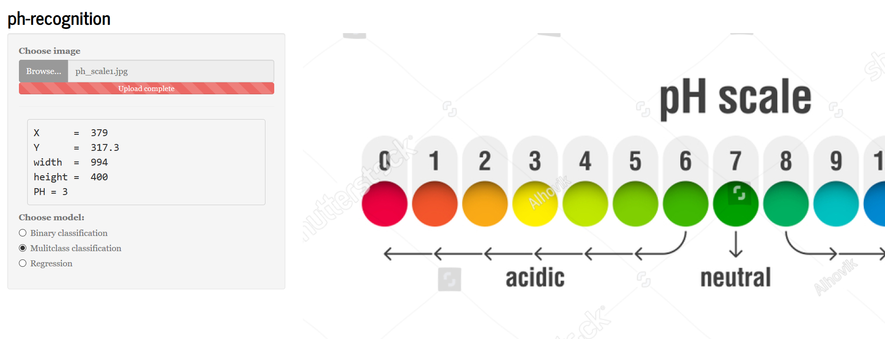

# ph-recognition

Show ph value from the image based on the its color. Using machine learning algorithms.

*** 
### [Online version](https://robertjankowski.shinyapps.io/ph-shiny-app/) 

I used `shinyapps.io` server to deploy application. Unfortunately `shinyapps.io` doesn't support Python modules such as `numpy`, `scipy`, `sklearn` so in this case to run app follow this steps:

- `git clone` or download repository
- `Rscript install_packages.R` - install necessary packages
- `R -e "shiny::runApp()"` - run shiny app

**TODO**

1. store in cache models (speed up)
2. resizing images

***
### From where I got datasets ?

I downloaded images of ph-scale from [here](https://www.shutterstock.com/search/ph+scale) then I croped into small pictures so for example the 0 ph value correspond to _0.jpg_. 

***
### jupyter notebooks

* ***binary_classification.ipynb*** - split into two bins (acid, base), calculate probablility, covariance matrices, data visualisation (*Plotly*), dimensionality reduction (_LDA, PCA, LLE, MDS, t-SNE, Isomap_)
* ***svn.ipynb*** - visualisation using *matplolib* library, split data for training and testing, models: *LinearSVR*, *SVR* with polynomial kernel, *SVC* with *RandomizedSearchCV*
* ***classification.ipynb*** - plotting, covariance matrix, split data, models: *LogisticRegression*, *DecisionTreeClassifier* with and without *GridSearch*, *GradientBoostingClassifier*, *VotingClassifier*, *BaggingClassifer*, *RandomForests*, *ExtraTrees*, *AdaBoostClassifier*, *XGBoost*.
* ***neural_network.ipynb*** - prepare data, create model using *Keras* library, graph accuracy and loss versus number of epochs
* ***process_data.ipynb*** - 2D and 3D graphs, split data, training on *GradientBoostingRegressor*, *RandomForestRegressor*
* ***unsupervised_lerning.ipynb*** - testing *KMeans* algorithm

***
## GUI
GUI was built in `PyQT` library. Clicking on the image generate pH value, which is shown on the bottom of the app.

***
